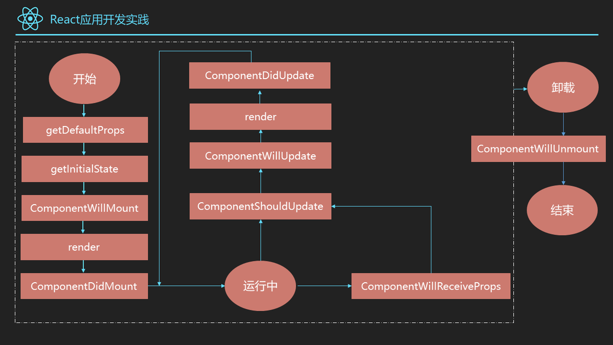

# 前端笔试面试简答题汇总

## JavaScript部分
### 1.引起内存泄漏的操作有哪些
1.全局变量引起

2.闭包引起

3.dom清空，事件未清除

4.子元素存在引用

5.被遗忘的计时器

参考：

[【译】JavaScript 内存泄漏问题](http://octman.com/blog/2016-06-28-four-types-of-leaks-in-your-javascript-code-and-how-to-get-rid-of-them/)

[JavaScript 常见的内存泄漏原因](https://juejin.im/entry/58158abaa0bb9f005873a843)


### 2.如何实现ajax请求

1.通过实例化一个XMLHttpRequest对象得到一个实例，调用实例的open方法为这次
ajax请求设定相应的http方法、相应的地址和以及是否异步，当然大多数情况下我们都是选异步，
以异步为例，之后调用send方法ajax请求，这个方法可以设定需要发送的报文主体，然后通过
监听readystatechange事件，通过这个实例的readyState属性来判断这个ajax请求的状态，其中分为0,1,2,3,4这四种
状态，当状态为4的时候也就是接收数据完成的时候，这时候可以通过实例的status属性判断这个请求是否成功
```javascript
var xhr = new XMLHttpRequest();
xhr.open('get', 'aabb.php', true);
xhr.send(null);
xhr.onreadystatechange = function() {
  if(xhr.readyState==4) {
    if(xhr.status==200) {
      console.log(xhr.responseText);
    }
  }
}
```

### 3.简要介绍ES6
ES6在变量的声明和定义方面增加了let、const声明变量，有局部变量的概念，赋值中有比较吸引人的结构赋值，同时ES6对字符串、
数组、正则、对象、函数等拓展了一些方法，如字符串方面的模板字符串、函数方面的默认参数、对象方面属性的简洁表达方式，ES6也
引入了新的数据类型symbol，新的数据结构set和map,symbol可以通过typeof检测出来，为解决异步回调问题，引入了promise和
generator，还有最为吸引人了实现Class和模块，通过Class可以更好的面向对象编程，使用模块加载方便模块化编程，当然考虑到
浏览器兼容性，我们在实际开发中需要使用babel进行编译。

### 4.对js原型的理解
我们知道在es6之前，js没有类和继承的概念，js是通过原型来实现继承的。在js中一个构造函数默认自带有一个prototype属性，
这个的属性值是一个对象，同时这个prototype对象自带有一个constructor属性，这个属性指向这个构造函数，同时每一个实例
都有一个__proto__属性指向这个prototype对象，我们可以将这个叫做隐式原型，我们在使用一个实例的方法的时候，会先检查
这个实例中是否有这个方法，没有则会继续向上查找这个prototype对象是否有这个方法，刚刚我们说到prototype是一个对象，
那么也即是说这个是一个对象的实例，那么这个对象同样也会有一个__proto__属性指向对象的prototype对象。

### 5.对js模块化的理解
在ES6出现之前，js没有标准的模块化概念，这也就造成了js多人写作开发容易造成全局污染的情况，以前我们可能会采用立即执行
函数、对象等方式来尽量减少变量这种情况，后面社区为了解决这个问题陆续提出了AMD规范和CMD规范，这里不同于Node.js的
CommonJS的原因在于服务端所有的模块都是存在于硬盘中的，加载和读取几乎是不需要时间的，而浏览器端因为加载速度取决于网速，
因此需要采用异步加载，AMD规范中使用define来定义一个模块，使用require方法来加载一个模块，现在ES6也推出了标准的模块
加载方案，通过exports和require来导出和导入模块。

### 6.如何实现一个JS的AMD模块加载器

### 7.简要介绍事件代理，以及什么时候使用

### 8.使用new操作符实例化一个对象的具体步骤
1.构造一个新的对象

2.将构造函数的作用域赋给新对象（也就是说this指向了新的对象）

3.执行构造函数中的代码

4.返回新对象

### 9.js如何判断网页中图片加载成功或者失败
使用onload事件运行加载成功，使用onerror事件判断失败

## Node.js部分
### 1.Express中实现中间件的原理

### 2.Node.js多线程编程

## CSS(3)部分
### 1.水平居中的方法
1.元素为行内元素，设置父元素text-align:center

2.如果元素宽度固定，可以设置左右margin为auto;

3.如果元素为绝对定位，设置父元素position为relative，元素设left:0;right:0;margin:auto;

4.使用flex-box布局，指定justify-content属性为center

5.display设置为tabel-ceil

### 2.垂直居中的方法
1.将显示方式设置为表格，display:table-cell,同时设置vertial-align：middle

2.使用flex布局，设置为align-item：center

3.绝对定位中设置bottom:0,top:0,并设置margin:auto

4.绝对定位中固定高度时设置top:50%，margin-top值为高度一半的负值

5.文本垂直居中设置line-height为height值

参考：

1.[CSS实现垂直居中的5种方法](https://www.qianduan.net/css-to-achieve-the-vertical-center-of-the-five-kinds-of-methods/)

2.[16种方法实现水平居中垂直居中](https://juejin.im/post/58f818bbb123db006233ab2a)

### 3.如何实现一个自适应的正方形
利用padding设置为百分比时是相对于父级元素的，因此同时设置width与padding-top(padding-bottom)为同一个百分数，
并且设置height:0即可实现一个正方形。

### 4.简要介绍一下flex布局

### 5.如何实现两列布局
1.将元素的display设置为行内元素

2.两个元素全部使用浮动

3.一个元素左浮动，第二个元素不便，同时设置一个margin-left值

4.使用flex-box布局

### 6.简要介绍一下CSS3的新特性

## HTML(5)
### 1.viewport的常见设置有哪些
viewport常常使用在响应式开发以及移动web开发中，viewport顾名思义就是用来设置视口，主要是规定视口的宽度、视口的初始缩放值、
视口的最小缩放值、视口的最大缩放值、是否允许用户缩放等。一个常见的viewport设置如下：
```html
<meta name="viewport"  content="initial-scale=1,maximum-scale=1,user-scalable=no,width=device-width" />
```
其中同时设置width和initial-scale的目的是为了解决iphone、ipad、ie横竖屏不分的情况，因为这两个值同时存在时会取较大值。

参考：

[移动前端开发之viewport的深入理解](https://www.cnblogs.com/2050/p/3877280.html)

[在移动浏览器中使用viewport元标签控制布局](https://developer.mozilla.org/zh-CN/docs/Mobile/Viewport_meta_tag)

### 2.简要介绍HTML5的新特性
首先HTML5为了更好的实践Web语义化，增加了header、footer、nav、aside、article、section等语义化标签。
在表单方面，为了增强表单，为input增加color、email、date、range等类型，在存储方面提供了sessionStorage
、localStorage和离线存储，通过这些存储方式方便数据在客户端的存储和获取，在多媒体方面规定了音频和视频元素audio和vedio；
另外还有地理定位、canvas画布、拖放、多线程编程的web workers和websocket协议

### 3.HTML5的存储方案有哪些
HTML5提供了sessionStorage、localStorage和离线存储作为新的存储方案，其中sessionStorage和localStorage
都是采用键值对的形式存储，两者都是通过setItem、getItem、removeItem来实现增删查改，而sessionStorage是会话存储，也就是说
当浏览器关闭之后sessionStorage也自动清空了，而localStorage不会，它没有时间上的限制。离线存储也就是应用程序缓存，这个通常用来
确保web应用能够在离线情况下使用，通过在html标签中属性manifest来声明需要缓存的文件，这个属性的值是一个包含需要缓存的文件的文件名的文件，
这个manifest文件声明的缓存文件可在初次加载后缓存在客户端，可以通过更新这个manifest文件来达到更新缓存文件的目的。

### 4.

## 移动Web
### 1.移动web开发与PC web开发的区别有哪些？
 
### 2.移动web开发中css常用的单位有哪些？

## 网络部分
### 1.页面从输入URL到展现发生了什么
输入URL之后，需要寻找到这个url域名的服务器IP，为了找到这个IP，浏览器首先会寻找缓存，
查看缓存中是否有记录，缓存中查找的顺序是浏览器缓存、系统缓存、路由器缓存，缓存中没有则
查找系统的hosts文件中是否有记录，如果没有记录则会查询DNS服务器，得到服务器的IP地址之
后，浏览器根据这个IP以及相应的端口号，（如HTTP协议默认的端口号为80，HTTPS协议的默认
端口号为443，当然可以在url中指定端口号）构造一个HTTP请求，并将这个HTTP包请求封装在
一个TCP包中，（这个HTTP请求报文会包含这次请求的信息，主要是请求方法、请求的说明和请
求附带的数据），这个tcp包依次会经过传输层、网络层、数据链路层、物理层到达服务器，服
务器解析这个请求来做出响应，（我们假定这个url是一个类似谷歌、淘宝这样的网站首页，而
不是简单的文件），服务器返回相应的HTML给浏览器，因为HTML是一个树形结构，浏览器根据
这个HTML来构建DOM树在DOM树的构建过程中如果遇到js脚本和外部js连接，则会停止构建DOM
树来执行和下载相应的代码，这会造成阻塞，这也就是为什么推荐js代码应该放在HTML代码的后
面，之后根据外部样式、内部样式、内联样式构建一个CSS对象模型树（CSSOM树），构建完成之
后和DOM树合并为渲染树，这里主要做的是排除非视觉节点，如script、meta标签和排除display
为none的节点，之后就是进行布局，布局主要是确定各个元素的位置和尺寸，之后就是渲染页面。
因为HTML文件中会含有图片、音频、视频等资源，在解析DOM的过程中，遇到这些都会进行并行下
载，当然浏览器对每个域的并行下载数量有一定的限制，一般是4-6个，当然在这些所有请求中我们
还需要关注的就是缓存，缓存一般通过Cache-Control、Last-Modify、Expires等首部字段控制。
Cache-Control和Expires的区别在于Cache-Control使用相对时间，Expires使用的是基于服务器
端的绝对时间，因为存在时差问题，一般采用Cache-Control，在请求这些有设置了缓存的数据时，会先
查看是否过期，如果没有过期则直接使用本地缓存，过期则请求并在服务器校验文件是否修改，如果上一次
响应设置了ETag值会在这次请求的时候作为If-None-Match的值交给服务器校验，如果一致，继续校验
Last-Modified，没有设置ETag则直接验证Last-Modified，再决定是否返回304

参考：

[缓存策略](http://ce.sysu.edu.cn/hope/Item/166703.aspx)

[浏览器内核、JS 引擎、页面呈现原理及其优化](https://www.zybuluo.com/yangfch3/note/671516)

[HTTP权威指南](https://book.douban.com/subject/10746113/)

### 2.cookie和session的异同
cookie和session都可以用来存储用户信息，cookie存放于客户端，session存放于服务端，因为cookie存放于客户端
有可能被窃取，因此cookie一般用来存放不敏感的信息，如用户设置的网站主题等，敏感的信息采用session存储，如用户
的登陆信息，session可以存放于文件、数据库、内存中都可以，cookie可以服务端响应的时候设置，也可以客户端通过js设置
cookie会在请求时在http首部发送给客户端，cookie一般在客户端有大小限制，一般为4k。

### 3.HTTP和HTTPS的区别
首先HTTP和HTTPS的默认端口号就不一样，HTTP的默认端口号为80，HTTPS的默认端口号为443，HTTP在传输过程中使用的是明文
传输，内容可能被窃取，而且无法验证通信方的身份，还有可能遭遇身份伪装，而HTTPS在应用层和传输层之间增加了ssl协议用来加密
内容，因此通过证书验证来验证身份，即使数据被窃取也无法解密，数据的传输更加安全。

### 4.ssl加密使用了那种算法，如何加密

### 5.TCP三次握手的过程，为什么是三次而不是四次？


### 6.TCP的四次挥手

### 7.HTTP报文的格式，传输中以何种方式传输

### 8.常见的HTTP头部
可以将HTTP首部分为通用首部、请求首部、响应首部、实体首部，通用首部表示一些通用信息，如Date表示报文创建时间，请求首部就是请求报文中
独有的，如cookie、和缓存相关的If-Modified-Since，响应首部就是响应报文中独有的，如set-cookie和重定向有关的location，实体首部用来
描述实体部分，如Allow用来描述可执行的请求方法，Content-Type描述主体类型，Content-Encoding描述主体的编码方式

参考：

[HTTP权威指南](https://book.douban.com/subject/10746113/)

### 9.HTTP状态的简要分类
可以按照HTTP状态码的第一个数字分类，1xx表示信息，2xx表示成功，3xx表示重定向，这里需要注意的是304，表示未修改，
4xx表示客户端错误，最常见的是404，5xx表示服务端错误

### 10.HTTP状态码101、200、301、302、304的具体含义
101：切换协议 200：正常，OK，301：永久重定向，302：临时重定向，304：未修改

### 11.301和302的区别


### 12.简要介绍一次302的过程
用户请求一个url，服务器处理这个url，设置这个url需要重定向，返回用户一个302响应，并在http头部设置location字段为新的地址，
浏览器得到这个响应，根据location中新的地址重新发起一次请求。

### 13.HTTP2.0的简要介绍

### 14.用户登陆过程的简要说明，如何判断用户是否登录？
用户输入用户名和密码，通过post请求将密码和用户名发送给服务器，服务器比对收到的用户名、密码和数据库中的数据进行比对，不一致则做出响应，
反馈信息给客户端，如果比对一致则服务端生成一个session，这个session可以存储在内存、文件、数据库中，同时生成一个与之一一对应的sessionID
作为cookie发送给客户端，比对成功之后反馈信息，这时一般会进行一次重定向，重定向至登陆之后的默认页面。判断用户登录则是根据这个sessionID，每次请求
会先检查有没有这次类似sessionID的cookie发送过来，没有则认为没有登录，有则是否有相应的session，这个session是否过期等，来判断用户是否登录，
登录是否过期。

### 15.tcp和udp的区别
TCP面向连接的、提供可靠传输的协议，而UDP则是面向非连接。不可靠传输的协议，之所以说TCP是可靠的传输协议是因为TCP协议在传输数据之前有一个确认双方是否
连接的过程，而UDP没有，也正是因此在传输速度方面，UDP更快。因此需要可靠传输需要选用TCP，不需要可靠传输情况下选择UDP。

### 16.udp的阻塞机制，如何处理

### 17.简要介绍一下socket协议


## 性能相关
### 1.常见的网页性能优化方法
+ 减少HTTP请求

使用雪碧图、内联图片，合并脚本和样式表。

+ 使用内容分发网络（CDN）

+ 添加Expires头

+ 压缩组件

压缩样式表和脚本，开启gzip压缩大概减少70%的大小

+ 样式表放在顶部

+ 将脚本放在底部

+ 避免CSS表达式

+ 使用外部JavaScript和CSS

+ 减少DNS查找

+ 精简JavaScript

+ 避免重定向

网站中除了域名首页外缺少斜杠将引起301重定向，个人测试工作室网站这个重定向消耗的时间在30ms左右

+ 删除重复脚本

+ 配置ETag

+ 使Ajax可缓存

参考：
[高性能网站建设指南](https://book.douban.com/subject/3132277/)


## 数据结构与算法

## React
### 1.虚拟DOM的原理
我们知道前端的DOM是一棵树，对于一个element来说，我们需要关注的是这个element的
tagName、属性、以及子元素，而这完全可以用一个js对象来表示，比如，使用tagName属性
来说明标签名，将所有的属性和值作为一个对象表示为props，children属性来表示这个element的
子元素，同样有了这个js对象，我们就可以构建一棵真实的DOM树，我们可以在每一次元素也就是js对象
有任何变动的时候来重新构造一棵树，将这棵新的树与旧的DOM数进行比对，找出真正差异的地方，然后
将这些差异应用在真实的DOM中，也就实现了一个简单的Vitual DOM算法。

参考
[深度剖析：如何实现一个 Virtual DOM 算法](https://github.com/livoras/blog/issues/13)

### 2.简要介绍一下React组件的生命周期
React的组件在第一次挂载的时候回首先获得父组件传递的props，接着获取初始的state值，接着经历挂载
阶段的三个生命周期函数也就是ComponentWillMount、render、ComponentDidMount，这三个函数
分别代表着组件将会挂载、组件渲染、组件挂载完毕三个阶段。在组件挂载完成之后，组件的props和state的任一
改变都会导致组件进入更新状态，在组件更新阶段如果是props改变，则进入ComponentWillReceiveProps函数，
接着进入ComponetShouldUpdate进行判定是否需要更新，如果是state的改变则直接进入ComponentShouldUpdate
判定，这个默认是true，当判定不需要更新的话，组件继续运行，需要更新则依次进入ComponentWillUpdate、render、
ComponentDidUpdate三个生命周期函数，依次代表着组件将要更新、组件在渲染、组件更新完毕。当组件卸载时，会首先
进入生命周期函数ComponentWillUnmount，之后才进行卸载。如下图：


### 3.简要介绍一下React中的refs以及它的作用
ref允许我们访问DOM元素，我们通过在组件中指定ref属性，属性值为一个回调函数，这个回调函数接受一个DOM元素或者react组件
作为参数，当我们不得不要直接访问DOM元素的时候才去使用它，如我需要在组件加载完成就立即让组件中的表单有焦点，即触发
focus事件

### 4.简要介绍一下key以及它的作用
在react中我们渲染一个列表的时候，我们需要为每一个列表项指定一个唯一的key，当没有指定key时，会收到一个warning，
如果指定的key不唯一，只会渲染第一个指定唯一的key的那个元素，使用key可以使得DOM diff更加高效，避免不必要的
列表项更新

### 5.在实际开发中shouldComponentUpdate有什么作用

### 6.简要介绍一下Redux

### 7.setState的第二个参数是什么，作用又是什么？
setState的第二个参数是一个回调函数，组件更新完后执行的回调函数（setState函数是异步的）

### 8.简要介绍一下你所了解的flux架构的思想？

### 9.聊一聊你对React的DOM diff算法的理解

## AngularJS
### 1.依赖注入的原理，如何实现一个简单的依赖注入
依赖注入原理通俗的说就是当一个函数需要某些对象的时候，这个函数只需要指明自己需要的对象，就会有一个容器
将这些对象自动传递给这个函数，在angularjs中的具体表现比如说我们定义了一个service，就可以在控制器中将这个
service作为参数使用。实现一个简答的依赖注入需要一个注册函数来作为依赖的注册，可以利用一个对象来实现注册依赖
的保存。一个注入函数来实现注入，注册函数很好处理，只需要将依赖的名字和对应的函数保存在依赖对象即可，而注入函数显然
需要的参数是一个声明依赖的数组，一个逻辑函数，对这个依赖数组遍历查看是否注册，使用hasOwnProperty是比较好的方法，
如果没有注册则放弃，注册了就将他push到一个数组中，最后返回一个function，这个function只需要使用apply方法将数组
作为参数传递给注入函数中的函数参数即可实现。

如何实现注入函数忽略参数传递的顺序？

可以利用正则去解析注册函数的参数，将注入函数中函数参数的参数解析出来，然后逐个去依赖中查询即可，这会带来的问题就是如果
压缩的话，这些参数会被一些简单的字母代替，也就意味着失效，angularjs的解决方式使用数组作为参数，数组最后一个就是依赖注入的函数
，当然这得保持依赖的顺序。

参考：

[AngularJs依赖注入的研究](http://www.alloyteam.com/2015/09/angularjs-study-of-dependency-injection/)
## Vue

## Web安全
### 1.常见的网站漏洞有哪些？

### 2.XSS如何防御

## SQL
### 1.内连接与外连接的区别

### 2.内连接、左连接、右连接的特点分别是什么
内连接中两张表必须同时有对应的数据，任何一方缺失数据，该行数据都不显示。
左连接则是读取左边表的所有数据，忽略右表是否有对应数据，右连接则与左连接相反，显示的是右表的所有数据

### 3.sql查询一个表中游戏充值前10%的用户

### 4.sql查询app榜单中排名比昨天排名上升了的app，并按上升名次倒序排列

### 5.MySQL的引擎有哪些？

## 计算机基础
### 1.冯诺依曼计算机的原理是什么？

### 2.堆和栈的区别是什么？

## 其他
### 1.Nginx常见的配置有哪些？

### 2.git常见的命令有哪些？

### 3.git和svn的区别有哪些？

### 4.了解jsbridge吗？介绍一下？

